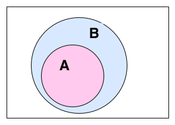

:title: Code Carrots Warszawa - warsztaty
:data-transition-duration: 500
:data-perspective: 0
:css: common_static/prezka_common.css

Prezentacja do warsztatów Code Carrots Warszawa na spotkanie 2015-03-18.

Materiały multimedialne są umieszczone w opcjonalnym katalogu ``*_mmedia``.

----

Zbiory (set)
============

**Gry plan:**

A. Hashables
B. Sets
C. Zadania

.. class:: para-footnote

    *18 Marca 2015 (środa)*

.. class:: footnote small

    (made with `hovercraft`_)

----

**Tylko** obiekty **Hashowalne** mogą być:

 - **Elementami** zbioru (**set**)
 - **Kluczami** słownika (**dict**)

----

Objekty Hashowalne (Hashables)
==============================

::

    An object is hashable if it has a hash value
    which never changes during its lifetime,
    and [the object] can be compared to other objects.

----

:class: center-text

Co to jest Hash?
================

Hash == Liczba

----

:class: big-code

Jak sprawdzić czy objekt jest `hashowalny`?
===========================================

.. code:: python

    hash('abc')
    hash(1)
    hash(100)
    hash(10**100)
    hash([1, 2, 3])

-----

Immutable == Hashable
=====================

**Objekty niezmienne są hashowalne.**

* *Nie musi być prawdą dla typów które nie są wbudowane w język tylko zdefiniowane w bibliotekach itp.*

-----

:class: plain-table

+-------------+---------------+
| **Mutable** | **Immutable** |
+=============+===============+
| - **list**  | - **string**  |
| - *set*     | - **tuple**   |
| - *dict*    | - **integer** |
| - ...       | - **float**   |
|             | - **bool**    |
|             | - ...         |
+-------------+---------------+

----

:class: center-code big-code

Zbiory (set)
============

.. code:: python

    class set([iterable])

-----

:class: center-text

Co to?
======

Nieuporządkowana kolekcja unikalnych (hashowalnych) objektów.

-----

Po co?
======

- Testowanie czy element (objekt) jest w kolekcji
- Usuwanie duplikatów
- Matematyka! (i nie tylko)
    - Suma (union) zbiorów
    - Iloczyn (część wspólna) (intersection) zbiorów
    - Różnica (difference) zbiorów
    - Różnica (symetrical difference) symetryczna zbiorów

-----

:class: big-code

Zbiory (set) - tworzenie
========================

.. code:: python

    a = {1, 'k', 2, 'zyx'}
    b = set([1, 'k', 2, 'zyx'])
    c = set((1, 'k', 2, 'zyx'))
    a == b == c  # True

----

:class: big-code

.. code:: python

    d = {'a', 'b', 'c'}
    e = set('abc')
    f = set(['a', 'b', 'c'])
    g = set(('a', 'b', 'c'))
    d == e == f == g  # True

----

:class: big-code

Zbiory (set) - modyfikowanie
============================

.. code:: python

    a = {1, 'k', 2, 'zyx'}
    a.add(10)
    a.remove('k')
    a.discard(2)
    a.pop()
    a.clear()

-----

:class: big-code

Zbiory (set) - remove vs. discard
=================================

.. code:: python

    a = {1, 'k', 2, 'zyx'}

    a.remove('do not exists in a')

    a.discard('do not exists in a')

----

:class: big-code

Zbiory (set) - ilość elementów
==============================

.. code:: python

    a = {1, 'k', 2, 'zyx'}

    len(a)  # 4

----

Zbiory (set) - operacje porównania
==================================

----

:class: big-code

.. code:: python

    a, b = {1, 2, 3}, {1, 2, 3}

    a == b
    a >= b
    a <= b
    a < b
    a > b

----

:class: big-code

.. code:: python

    a, b = {1, 2, 3}, {1, 2, 3}

    a == b  # True
    a >= b  # True
    a <= b  # True
    a < b   # False
    a > b   # False

----

:class: big-code

.. code:: python

    a, b = {1, 2}, {1, 2, 3}

    a == b
    a >= b
    a <= b
    a < b
    a > b

----

:class: big-code

.. code:: python

    a, b = {1, 2}, {1, 2, 3}

    a == b  # False
    a >= b  # False
    a <= b  # True
    a < b   # True
    a > b   # False

----

:class: big-code

.. code:: python

    a, b = {1, 2}, {3, 4}

    a == b
    a >= b
    a <= b
    a < b
    a > b

----

:class: big-code

.. code:: python

    a, b = {1, 2}, {3, 4}

    a == b  # False
    a >= b  # False
    a <= b  # False
    a < b   # False
    a > b   # False

----

:class: big-code

.. code:: python

    a = {'a', 'b', 1, 2}

    'a' in a
    'b' in a
    'c' in a
    1 in a
    2 not in a

----

:class: big-code

.. code:: python

    a = {'a', 'b', 1, 2}

    'a' in a    # True
    'b' in a    # True
    'c' in a    # False
    1 in a      # True
    2 not in a  # False

----

Zbiory (set) - operacje matematyczne!?
======================================

.. image:: 2015-03-18_prezka_mmedia/set-operations.www.texample.net.png
    :width: 800px
    :height: 800px

-----

:class: big-code

Iloczyn zbiorów (część wspólna)
===============================

.. code:: python

    abc = set('abc')
    cde = set('cde')

    abc & cde  # {'c'}
    abc.intersection(cde)

----

:class: big-code

Suma zbiorów
============

.. code:: python

    abc = set('abc')
    cde = set('cde')

    abc | cde  # {'c', 'b', 'e', 'd', 'f', 'a'}
    abc.union(cde)

----

:class: big-code

Różnica zbiorów
===============

.. code:: python

    abc = set('abc')
    cde = set('cde')

    abc - cde  # {'a', 'b'}
    abc.difference(cde)

    cde - abc  # {'d', 'e'}
    cde.difference(abc)

----

:class: big-code

Różnica symetryczna zbiorów
===========================

.. code:: python

    abc = set('abc')
    cde = set('cde')

    abc ^ cde  # {'a', 'b', 'd', 'e'}
    abc.symmetric_difference(cde)

    cde ^ abc  # {'a', 'b', 'd', 'e'}
    cde.symmetric_difference(abc)

----

Pytania?
========

----

Zadania!
========

**sets_XX.py**

.. _`hovercraft`: https://github.com/regebro/hovercraft/